# Showcase Your Learning With Docusaurus + Azure Static Web App

This is a tutorial shared as part of the #30DaysOfSWA series, to showcase the use of Azure Static Web Apps with the open-source Docusaurus static site generator from Meta.

## What We'll Learn:

 * What is Docusaurus?
 * Quickstart: setup classic site
 * Configure: docusaurus.config.js
 * Deploy: Azure Static Web Apps
 * Customize: Themes & Plugins
 * `Exercise`: 
    - Add API to fetch content!
    - Add Auth to tweet content!
    - Add MDX component to page!

---

## What is Docusaurus?

Docusaurus is an open-source project from Meta that helps you build, deploy, and maintain, open source project websites. It was rated one of the top 3 [rising stars of JavaScript](https://docusaurus.io/) in 2021, under the _static site generators_ category. 

Read their [documentation](https://docusaurus.io/docs) and visit their [showcase](https://docusaurus.io/showcase) for real-world examples of what you can build with docusaurus.

---

## Setup Site: Quickstart

1. Setup a Docusaurus site (`classic` theme) in a dedicated folder (`www`) in repo. The command automatically installs the required packages and their dependencies.

```bash
 npx create-docusaurus@latest www classic
```

2. Let's see what was created for us. The output has been cleaned up for clarity.

```
ls -l www/

README.md   
babel.config.js 
blog/              
docs/    
docusaurus.config.js               
node_modules/        
package-lock.json    
package.json           
sidebars.js                 
src/                  
static/    
```

3. Let's preview the site locally, to validate this worked.

```bash
cd www
npx docusaurus start

[INFO] Starting the development server...
[SUCCESS] Docusaurus website is running at http://localhost:3000/.
```

You should see something like this - this is the default landing page for the scaffolded Docusaurus site.

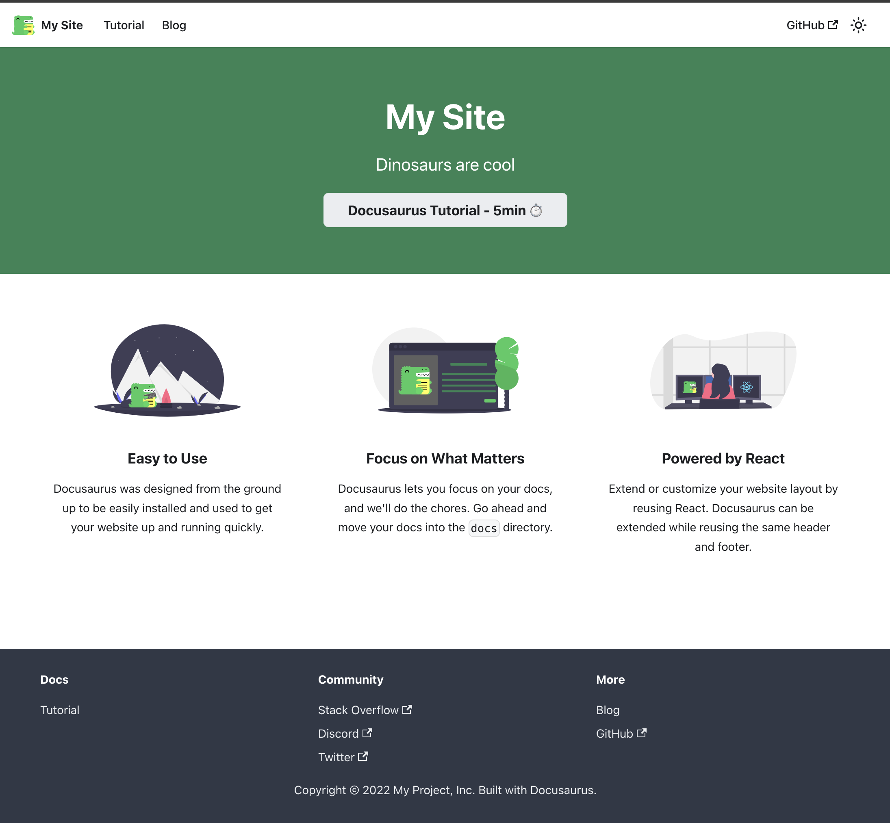

4. The dev server supports hot reloading. Try making a minor change to the site source - for example edit `docusaurus.config.js` and change the `title` to **"My Static Web Apps Site"**. You should see this in your site preview, instantly:

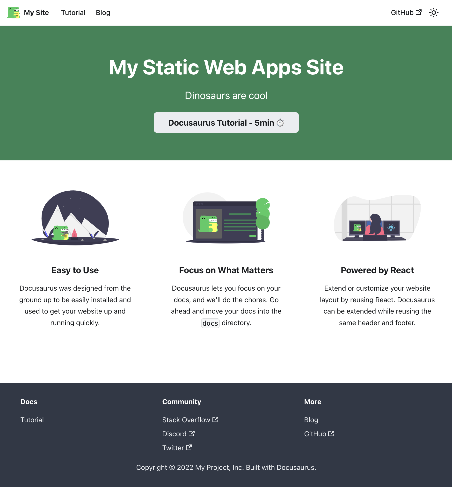

5. You can now build a **production-ready** version of that site as follows. Note that the static files are generated in the **build/** directory.

```bash
cd www/
npm run build
..
..
[SUCCESS] Generated static files in "build".
[INFO] Use `npm run serve` command to test your build locally.
```

## Deploy Site: To Azure

Docusaurus is built using React - so you can use [the same configuration settings](https://docs.microsoft.com/en-us/azure/static-web-apps/front-end-frameworks) for Docusaurus, when deploying to Azure Static Web Apps. 

You have three options to  get started:
 * via browser with [the Azure Portal quickstart](https://docs.microsoft.com/en-us/azure/static-web-apps/getting-started?tabs=react)
  * via terminal with [the Azure CLI quickstart](https://docs.microsoft.com/en-us/azure/static-web-apps/get-started-cli?tabs=vanilla-javascript)
  * via IDE with [the VS Code Extension quickstart](https://docs.microsoft.com/en-us/azure/static-web-apps/getting-started?tabs=vanilla-javascript) 

If you prefer the first approach, click the button to go to the Azure portal, then follow the [quickstart](https://docs.microsoft.com/en-us/azure/static-web-apps/getting-started?tabs=react) guidance, but using *this* project's details instead.

[](https://portal.azure.com/?feature.customportal=false&WT.mc_id=30daysofswa-61155-cxall#create/Microsoft.StaticApp)

## Deploy Site: using VSCode

I'll use the [Visual Studio Code extension](https://docs.microsoft.com/en-us/azure/static-web-apps/getting-started?tabs=vanilla-javascript) to make this happen with just a few clicks. 

The whole process happens within the VS Code window, and takes just a few minutes from start to finish - _with guided prompts to help all the way_. For convenience, I've documented it step-by-step with screenshots (images valid for _VS Code ver 1.66.2_).

> 1. Install the Extension

Open Visual Studio Code (IDE) in the project folder for your repo. Install the [Azure Static Web Apps extension](https://marketplace.visualstudio.com/items?itemName=ms-azuretools.vscode-azurestaticwebapps) by visiting this page and clicking "Install".

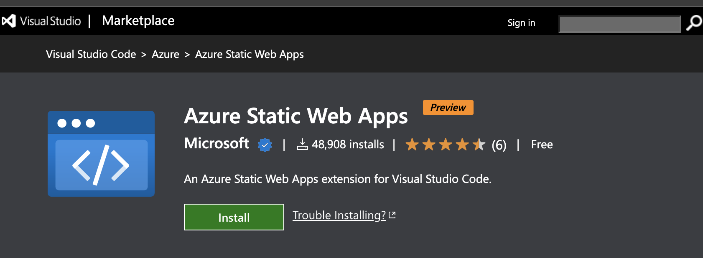

> 2. Validate Extension Install

When extension is installed, you should see this window in your VS Code editor, confirming readiness for use.

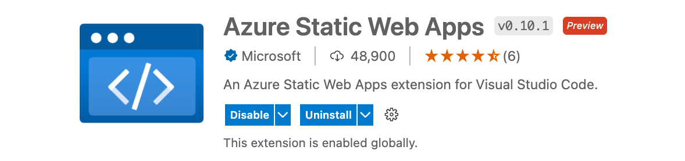

> 3. Find Azure Static Web Apps section under "Azure"

The extension's [documentation page](https://marketplace.visualstudio.com/items?itemName=ms-azuretools.vscode-azurestaticwebapps) and its [GitHub](https://github.com/microsoft/vscode-azurestaticwebapps/wiki/Creating-a-Static-Web-App) page both provide detailed walkthroughs - check those for the most current process for this. We'll start by clicking the _Azure_ icon in the VS Code sidebar, then scrolling down till we see this `Static Web Apps` section.

Click the "+" button to start the **Create Static Web App** workflow.

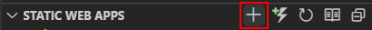

> 4. Commit project changes if needed.

The _"Create Static Web Apps"_ process will create (and commit) a GitHub actions workflow for you that will automate the build/deploy process for your site directly from your source on all future codebase changes.

So if you have _current pending codebase changes_ it will first prompt you to commit them before it does its magic! Let's get that done!

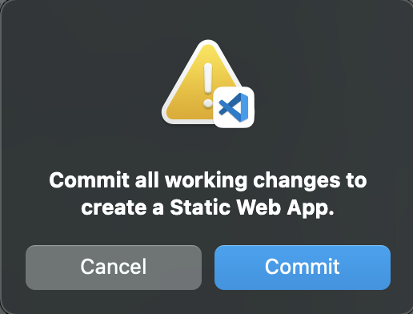


> 5. Follow the 5-step prompts

The extension walks you through the five steps shown below, each with defaults already filled in for you. Customize them as shown, for this project:

| Screenshot | Step |
|:---|:---|
| 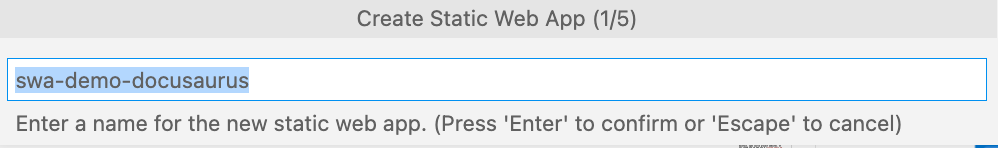<br/> | Specify project name |
| 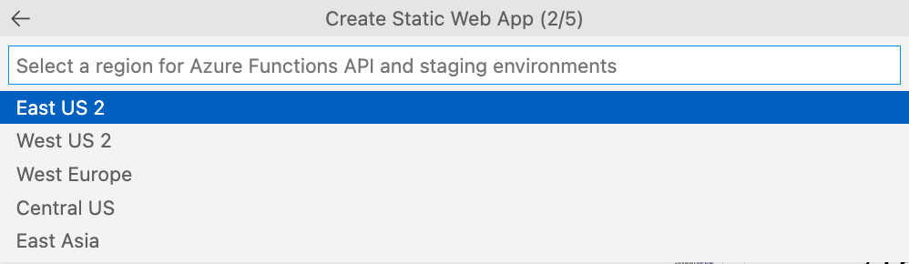 <br/>| Pick Azure region to deploy it in |
| 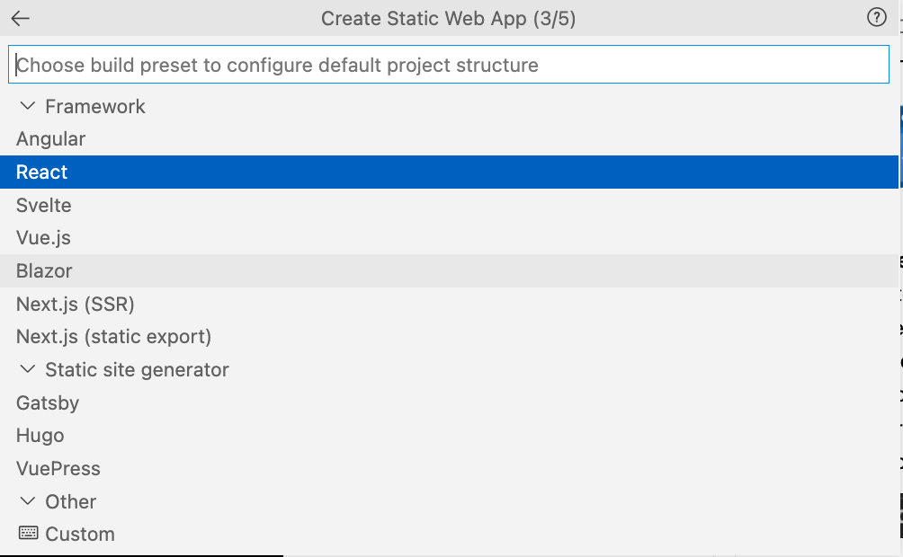<br/> | Pick framework used by app |
| 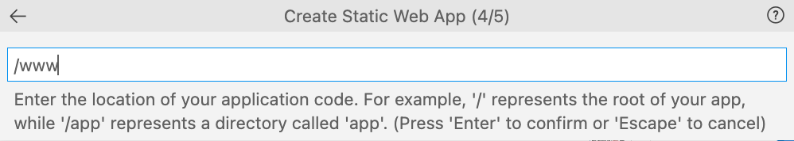<br/> | Specify folder contaning site source |
| 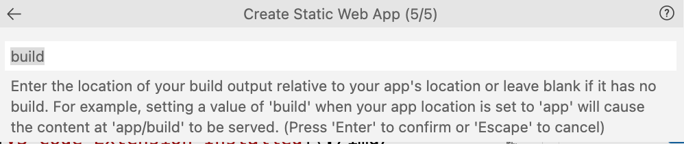<br/> | Specify folder where site gets built by default |
| | |

> 6. Sit back and relax!

In a few seconds, you'll see this alert - this indicates that the workflow is **creating and committing the GitHub Actions build/deploy workflow YAML** for you. 🎉

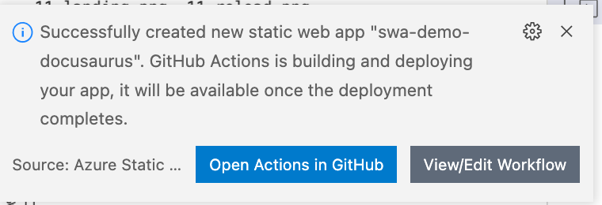

If you check your repository right now, you'll find the [relevant commit](https://github.com/fearlessly-dev/swa-demo-docusaurus/commit/1005a16c10bbbce51c8526a3c14253d1aec1a59c) and the [activated Actions flow](https://github.com/fearlessly-dev/swa-demo-docusaurus/actions/runs/2313039968) (labeled `ci: add Azure Static Web Apps worfklow`) in progress.

You can also track the progress and configuration settings of your app right there in the VS Code Sidebar, under the `Static Web Apps` section. _Look for the project name, and unroll contents.._

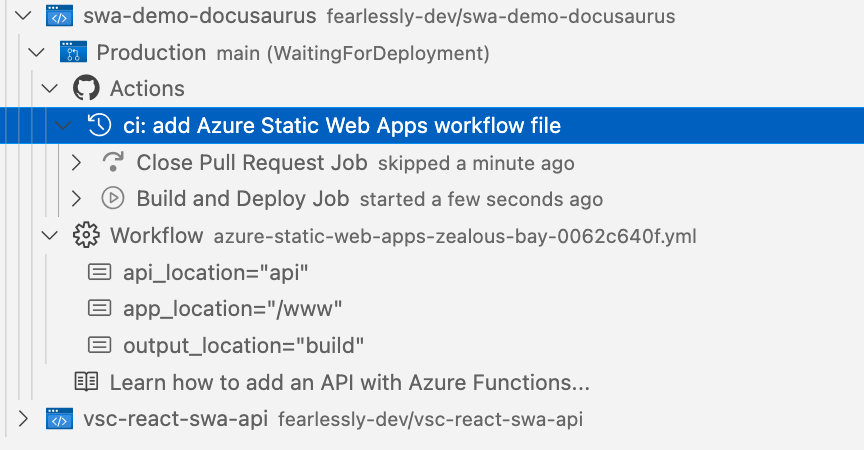


> 7. Validate the deploy!

In a few second more, you'll get this alert:

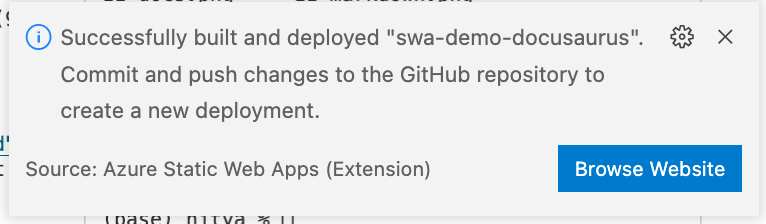

Now, go to the sidebar section for your project, right-click the name to see the available menu options:

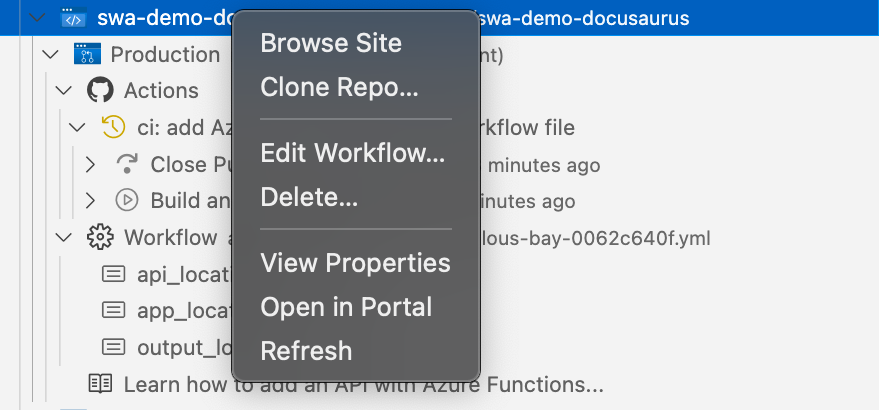

Click "Browse Site" to be taken to your live deployed Docusaurus website! That's it! A few clicks, customizing defaults - and you're done!

---

## Next: Customize It!

At this point, you can make any changes to the site source, commit them - and watch the site get rebuilt and deployed without any further action from you!

Here are some things to try:
 * Customize [styles or layout](https://docusaurus.io/docs/styling-layout)
 * Explore [plugins](https://docusaurus.io/docs/api/plugins) for SEO, Search etc.
 * Try [create/use MDX](https://docusaurus.io/docs/markdown-features/react#using-jsx-in-markdown) in content

I a few examples changes to the `docusaurus.config.js` file to personalize the landing page content to reflect my needs. 

And I updated the `src/css/custom.css` file to reflect new theme colors for dark/light mode - and replaced the `logo.svg` file.

Committing these changes should automatically rebuild and update the deployed site. Here is what they looked like in my local preview, before I committed the changes.

|Light Mode |  Dark Mode|
|:---|:---|
|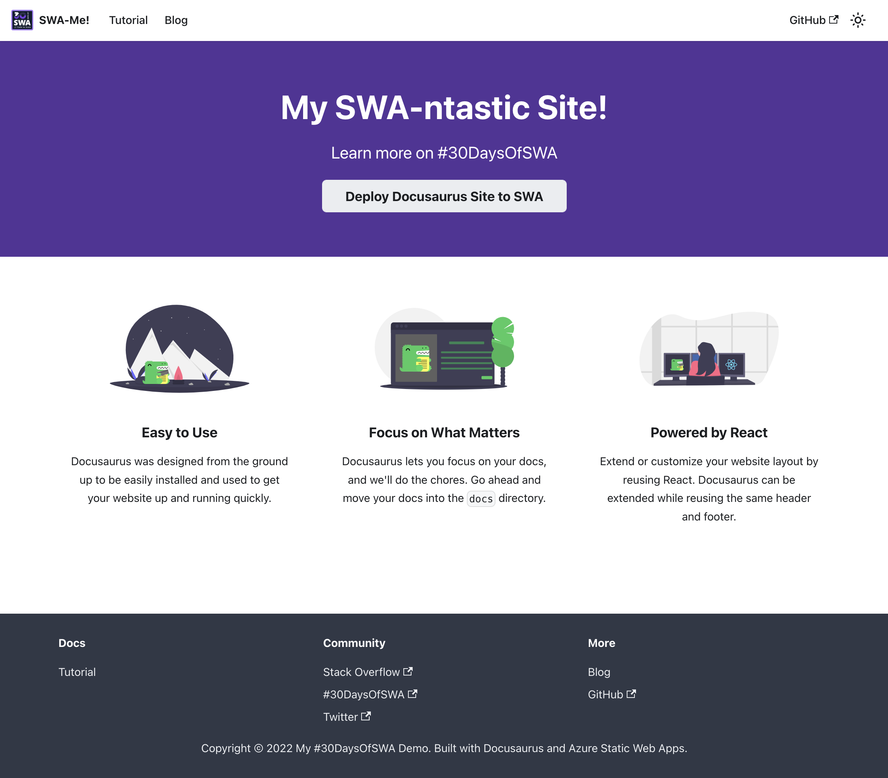|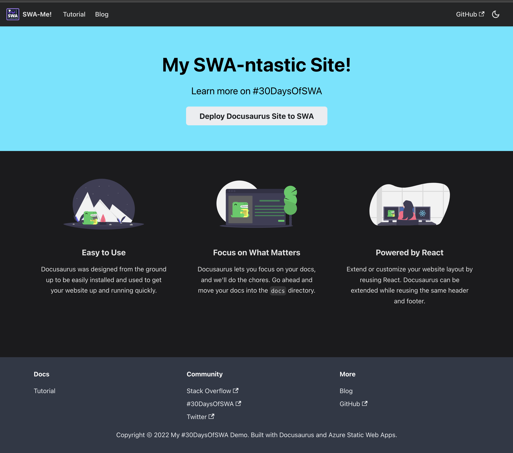 |


---

## Exercise

  - Add API to fetch content!
  - Add Auth to tweet content!
  - Add MDX component to page!

## Resources


---

🎉  **Check it out: The site is [live on Azure Static Web Apps](https://zealous-bay-0062c640f.1.azurestaticapps.net/)**

---